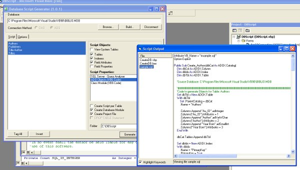



## Database Script/Code Generator \(23 Nov 05\)

### Description

Generates DBMS Scripts (SQL Server Query Analyser) or VB6 Source Code from a database. Uses either ADO or DAO to connect to database depending on the output required. Query Analyser scripting is useful for migrating a Jet (Access) database to SQL Server. It migrates Tables, Indexes &amp; Constraints (for Default Values etc). The VB6 code generator produces ADO or DAO Object based code to create the database in code or create Class Objects to encapsulate the Tables. Also creates Project &amp; module to integrate all the build code. I intend to expand the langauges and DMBS it can script to. Hope it may be useful to some! Feedback welcome and votes always nice ;)

- 23 Nov 05 New Upload
 
### More Info
 

             |
---                |---
**Submitted On**   |2005-11-17 17:31:06
**By**             |[Richard Mewett](https://github.com/Planet-Source-Code/PSCIndex/blob/master/ByAuthor/richard-mewett.md)
**Level**          |Intermediate
**User Rating**    |5.0 (35 globes from 7 users)
**Compatibility**  |VB 6\.0
**Category**       |[Databases/ Data Access/ DAO/ ADO](https://github.com/Planet-Source-Code/PSCIndex/blob/master/ByCategory/databases-data-access-dao-ado__1-6.md)
**World**          |[Visual Basic](https://github.com/Planet-Source-Code/PSCIndex/blob/master/ByWorld/visual-basic.md)
**Archive File**   |[Database\_S19505611232005\.zip](https://github.com/Planet-Source-Code/richard-mewett-database-script-code-generator-23-nov-05__1-63287/archive/master.zip)

